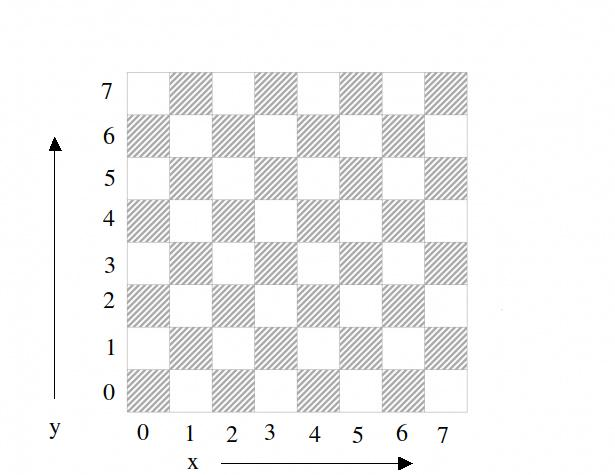

# Chess-REST-API
It's a simple REST API for checking chess figure moves and their moves validation.

This API running on a flask and doesen't have any restrictions.


## Instalation:

Run the following command in your terminal:

Clone repository using SSH key:

```
git clone git@github.com:Daniken94/Chess-REST-API.git
```
or download 'zip'.

## Requirements:
Python is required !!!


You can install all app from requirements.txt by using command:

```
pip install -r requirements.txt
```
Or you can do it manually by executing the following commands:

```
pip install flask==2.1.2
```
```
pip install flask_restful==0.3.9
```
```
pip install pytest==7.1.2
```

## Execution:

Run the following code in your terminal:

```
python main.py
```
In order to terminate the use and shut down the server it is necessary to run command in your terminal:

```
crtl + c
```

# How it work:





You can move the figure by chessboard cords. It's horizontal x and vertical y. Every axis has got value 0-7.

## How it use:

In this app you can easily check available moves chosen figures.

How to do it:

Url endpoint is:

`http://127.0.0.1:5000/api/v1/figure>/cords_from_x_axis/cords_from_y_axis`

```
http://127.0.0.1:5000 = localhost5000

/api/v1/ = it's required

figure = figure you want to check. You can choose from pawn, rook, bishop, knight, queen, king.

cords_from_x_axis = horizontal cords from 0-7

cords_from_y_axis = vertical cords from 0-7
```

For example:
If you want check available moves for King while standing on cords (0, 4) you must use endpoint:

`http://127.0.0.1:5000/api/v1/king/0/4`

or if you want check available moves for Rook while standing on cords (2, 0) you must use endpoint:

`http://127.0.0.1:5000/api/v1/rook/2/4`


In this app you can also easily check validation for chosen figures moves.


How to do it:

Url endpoint is:

`http://127.0.0.1:5000/api/v1/figure>/cords_from_x_axis/cords_from_y_axis/cords_to_destiny_x_axis/cords_to_destiny_y_axis`

```
http://127.0.0.1:5000 = localhost5000

/api/v1/ = it's required

figure = figure you want to check. You can choose from pawn, rook, bishop, knight, queen, king.

cords_from_x_axis = horizontal cords from 0-7

cords_from_y_axis = vertical cords from 0-7

cords_to_destiny_x_axis = horizontal destiny cords from 0-7

cords_to_destiny_y_axis = vertical destiny cords from 0-7
```


For example:

If you want check that Pawn from (2, 1) cords can go to (2, 2) cords you must use endpoint:

`http://127.0.0.1:5000/api/v1/pawn/2/1/2/2`

or if you want check that Bishop from (1, 0) cords can go to (6, 6) cords you must use endpoint:

`http://127.0.0.1:5000/api/v1/bishop/1/0/6/6`

